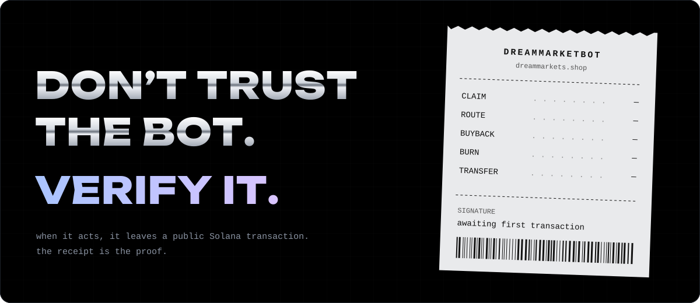
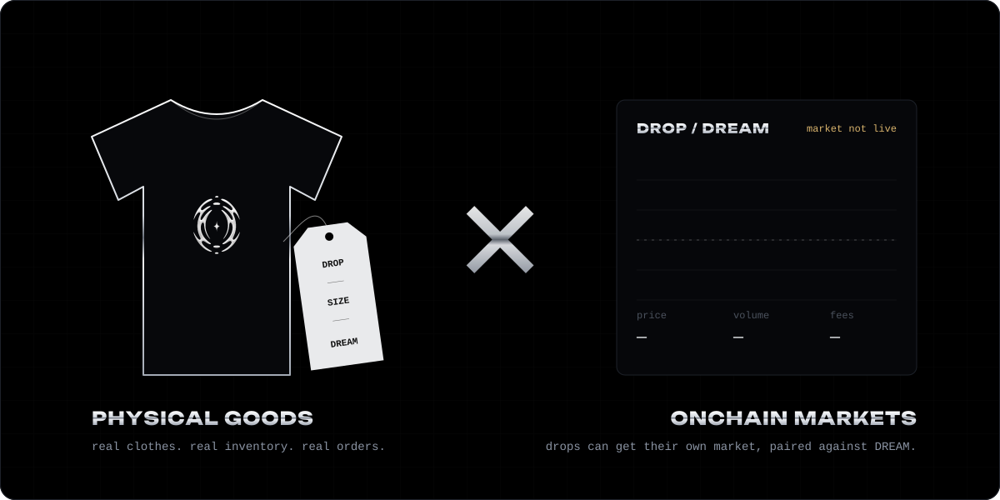

<p align="center">
  <a href="https://dreammarkets.shop">
    
  </a>
</p>

<div align="center">

**DreamMarketBot is the autonomous economic router being built for [DREAM Market](https://dreammarkets.shop).**

It watches the fees.<br>
It claims them.<br>
It routes them by rule.<br>
It leaves a receipt onchain.

<sub>Pre-launch. Everything below is the system being built, not a system that is running.<br>This repository currently holds this README and its visual assets. No bot code is published yet.</sub>

<br>

<a href="https://dreammarkets.shop"><b>dreammarkets.shop</b></a>

</div>

<br>

### Status

<!--
  STATUS PANEL
  assets/status.svg is a static file. Until the bot is connected, every value stays "—".
  Proposed: the recorder regenerates this SVG from confirmed onchain reads only.
  Never hand-edit numbers into it.
-->
<p align="center">
  
</p>

A blank value means nothing has been measured yet. When the bot comes online, every figure on this panel will be read from chain and traceable to a transaction signature. Nothing here will ever be estimated.

<br>

<p align="center">
  
</p>

Every claim moves through the same four stages. Nothing skips a stage.

| Stage | What happens |
| :-- | :-- |
| **`CLAIM`** | Collects fees that have accrued to eligible DREAM Market sources. |
| **`ROUTE`** | Splits the claim using allocation rules that are fixed and published in advance. |
| **`EXECUTE`** | Performs the result: buy DREAM, burn DREAM, or transfer to store operations and drops. |
| **`VERIFY`** | Publishes the transaction signature for each action so anyone can check it. |

The allocation split is intentionally not shown. It will appear here when it is final, and not before.

<br>

<p align="center">
  
</p>

### Latest actions

<!--
  LEDGER
  Append rows from confirmed transactions only. Newest first.
  Row format:
  | YYYY-MM-DD HH:MM | CLAIM | amount + token | destination | [first8…last8](https://explorer.solana.com/tx/<SIGNATURE>) |
-->

| Time (UTC) | Action | Amount | Destination | Signature |
| :-- | :-- | :-- | :-- | :-- |
| — | — | — | — | *awaiting first transaction* |

<details>
<summary><b>What each action means</b></summary>
<br>

| Action | Meaning |
| :-- | :-- |
| **`CLAIM`** | Fees collected from an eligible source into the bot wallet. |
| **`ROUTE`** | The claim divided according to the published rules. |
| **`BUYBACK`** | DREAM purchased on the open market. |
| **`BURN`** | DREAM permanently removed from supply. |
| **`TRANSFER`** | Funds sent to store operations or a future drop. |

</details>

Three rules the bot is being built around:

> **Rules before money.** Allocations are published before any claim is routed.<br>
> **No number without a signature.** Every figure links to the transaction that produced it.<br>
> **Receipts are public.** If it happened onchain, it shows up here.

<br>

### Physical goods × onchain markets

<p align="center">
  
</p>

DREAM Market is a clothing store first. Real garments, real inventory, real orders, paid for in DREAM. Each drop can also get its own onchain market paired against DREAM, so the thing you wear and the market around it share one economy.

DreamMarketBot is the part that connects them: fees from those markets can flow back into the store itself, into manufacturing, inventory and the next drop.

<br>

<p align="center">
  
</p>

<br>

### Architecture

<sub>Proposed. None of these components are deployed.</sub>

```text
SOLANA
  │
  ├── drop / DREAM markets
  ├── DREAM liquidity
  └── other eligible fee sources
            │
            ▼
┌───────────────────────────────┐
│  DREAMMARKETBOT               │
│                               │
│  watcher    reads accrued fees│
│  claimer    collects them     │
│  router     applies the rules │
│  executor   buy / burn / send │
│  recorder   logs signatures   │
└───────────────┬───────────────┘
                ▼
       onchain transactions
                ▼
          public records ───▶ this README
                ▼
        dreammarkets.shop
```

<br>

### Repository

What exists today:

```text
DreamMarketBot/
├── README.md
└── assets/
    ├── hero.svg
    ├── status.svg
    ├── router.svg
    ├── verify.svg
    ├── physical-onchain.svg
    ├── economy.svg
    ├── dream-logo.png
    └── dream-logo-ink.png
```

<details>
<summary><b>Proposed structure</b> <sub>(not built yet)</sub></summary>
<br>

```text
DreamMarketBot/
├── src/
│   ├── watcher/     fee source monitoring
│   ├── claimer/     claim transactions
│   ├── router/      allocation rules
│   ├── executor/    buyback, burn, transfer
│   └── recorder/    signature log, status render
├── config/
│   └── routes       published allocation rules
├── records/         append-only action log
└── assets/          README visuals
```

</details>

<br>

### Links

| | |
| :-- | :-- |
| **Store** | [dreammarkets.shop](https://dreammarkets.shop) |
| **X** | `pending` |
| **DREAM token (CA)** | `pending` |
| **Bot wallet** | `pending` |
| **Explorer** | `pending` |
| **Trade** | `pending` |
| **Docs** | `pending` |

<sub>Only addresses listed here are official. If an address is not on this page, it is not DREAM Market's.</sub>

<br>
<br>

<p align="center">
  <a href="https://dreammarkets.shop">
    <picture>
      <source media="(prefers-color-scheme: dark)" srcset="assets/dream-logo.png">
      
    </picture>
  </a>
</p>

<p align="center">
  <sub><b>THE STORE IS THE MARKET.</b></sub><br>
  <sub><a href="https://dreammarkets.shop">dreammarkets.shop</a></sub>
</p>
